<!-- p178-189 -->
<!-- class: title  -->

# 7章 畳み込みニューラルネットワーク
高柳海斗(リュカ)

---
<!-- class: slides  -->
# 畳み込みニューラルネットワーク(convolutional neural network: CNN)
画像認識や音声認識など、形を持ったデータに対して有効な手法。

今までのAffinレイヤに加え、Convolution レイヤ(畳み込み層)とPooling レイヤ(プーリング層)を組み合わせてネットワークを構成する。

---
<!-- _footer: ""-->
# 全結合NNと畳み込みNN
- **全結合ニューラルネットワーク**
  これまで実装してきたモデル

  

- **畳み込みニューラルネットワーク(CNN)**
  ConvolutionレイヤとPoolingレイヤを持つモデル

  

---
# 全層結合層の問題点
- 入力データの形が無視されてしまう
  - MNISTデータは3次元の形状(チャンネル数=1, 縦=28, 横=28)を持つデータだが、学習時には1列に並べた784個の要素を持つデータにして学習した

CNNでは
- データは形状を維持して層の間を流れる
  - 形状を有したデータを正しく理解できる(可能性がある)
---
# 
### 特徴マップ(feature map)
畳み込み層の入出力データのこと
入力データを入力特徴マップ、出力データを出力特徴マップという
教科書では「入出力データ」と「特徴マップ」を同じ意味の言葉として用いている

---
# 畳み込み演算
行列 $A,B$ の畳み込み演算 $A\circledast B$を以下で定義する

$$(A\circledast B)_{i,j} \coloneqq \sum _{a,b} A_{i+a,j+b} B_{a,b}$$

(数学の畳み込みとちょっと違う...)

$B$ をカーネル(あるいはフィルター)と呼ぶ

---
# 計算の具体例

  

---

  

---

  

---

  

---

  

---
# 畳み込み層のバイアス
畳み込み層も Affin レイヤと同様にバイアス項をパラメータにもつ

  

---
<!-- _footer: "" -->
# パディング
入力データの周囲を固定のデータ(0など)で埋めることをパディングという。これにより出力サイズを調整できる。

  

---
<!-- _footer: "" -->

# ストライド
フィルターを適用する位置の間隔をストライドという。

  

---

  

---
# 入力サイズと出力サイズの関係
入力サイズを $(H, W)$, フィルターサイズを $(FH, FW)$, パディングを $P$, ストライドを $S$ とする。
このとき、出力サイズ $(OH, OW)$ は以下の式で計算できる

$$OH = \frac{H + 2P - FH}{S} + 1$$
$$OW = \frac{W + 2P - FW}{S} + 1$$

左辺が整数になるように各サイズを設定する必要がある

---
# 畳み込みと相互相関のちがい
一般的に畳み込みとは以下の演算のことをいう
$$f\circledast g (x) = \int f(t)g(x - t) dt $$
一方、次の形で定義された演算は相互相関と呼ばれる
$$f\odot g (x) = \int f(t)g(x + t) dt $$
今回畳み込み層で使ったのは相互相関(を適切に読み替えたもの)

---
<!-- _footer: "" -->
ほぼ同じに思えるが、畳み込みのほうがよい性質を持つ

$$
\begin{aligned}
  f \circledast g (x) 
  &= \int^{\infty}_{-\infty} f(x)g(x-t) dt \\ 
  & x - t = s と置換して \\
  &= \int^{-\infty}_{\infty} f(x-s)g(s) (-ds)\\ 
  &= \int^{\infty}_{-\infty} f(x-s)g(s) ds \\ 
  &= g \circledast f (x) 
\end{aligned}
$$

より$f \circledast g (x) = g\circledast f(x)$を得るが、
相互相関については $f\odot g (x) = g\odot f(-x)$ となる