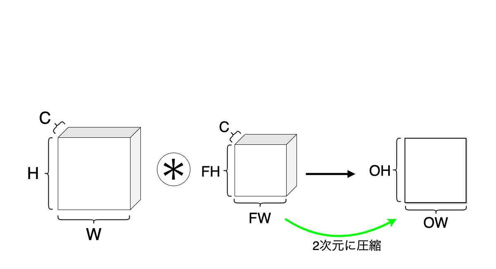

<!--
headingDivider: 2
_class: title
_paginate: false
-->
# 3次元畳み込み / プーリング層
<a style="color:#eeeeee; text-decoration: none;" href="https://github.com/kentakom1213">ぱうえる（けんた）:link:</a>

## 3次元の画像とは？

## 3次元の畳み込み
3次元に拡張するとどうなる？

## 3次元の畳み込み
計算方法
1. **レイヤーごとに畳み込み**を行う
2. **それらの和**を求める

## 手順1

<!--
_footer: ""
-->

## 手順2
- 畳み込みを行ったもの同士を足し合わせる

<!--
_footer: ""
-->

## 3次元畳み込みの注意！
入力データとフィルターの**チャンネル数**が同じである必要がある

$$
(C,H,W) \ast (C,FH,FW) \to (1,OH,OW)
$$

## 3次元畳み込みの注意！（図）

<!--
_footer: ""
-->

## 複数のフィルターによる畳み込み

## バイアス・バッチ処理

<!--
_footer: ""
-->

## プーリング層

